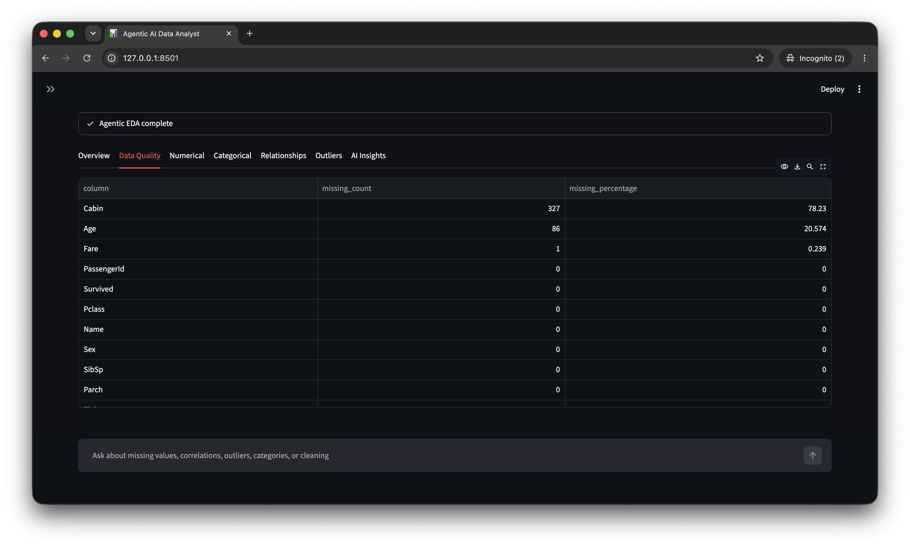
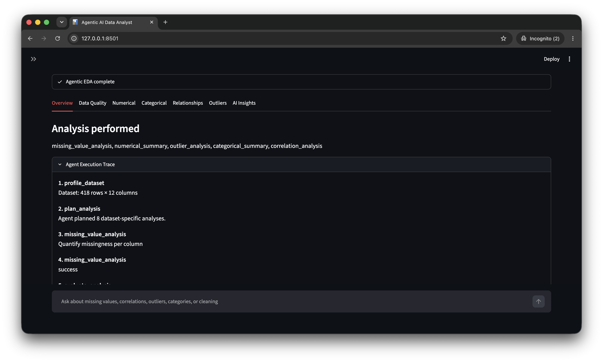
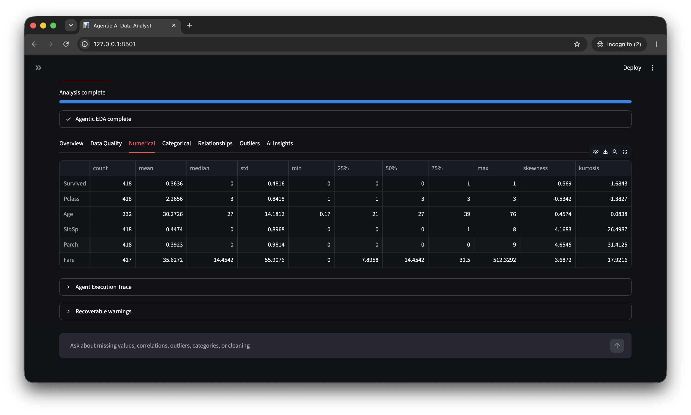
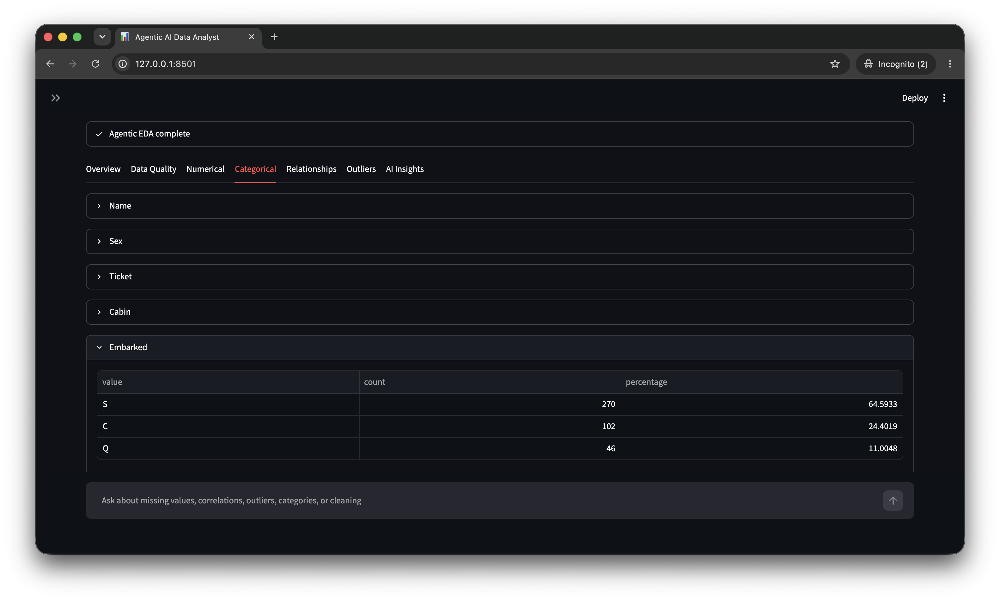
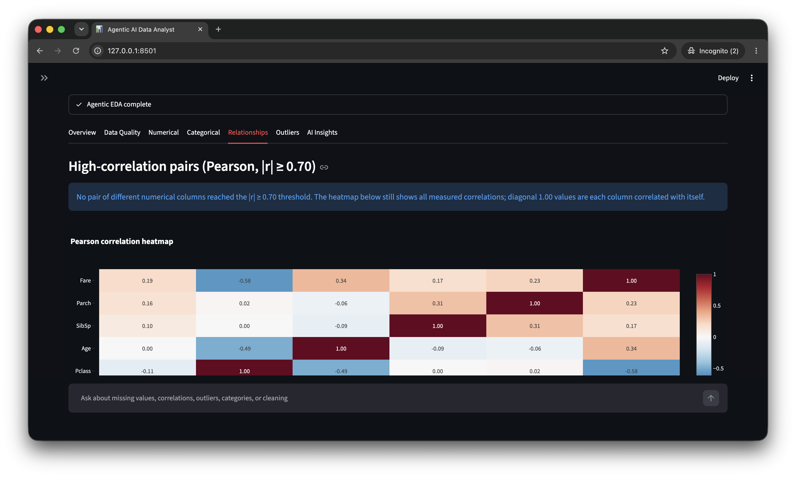
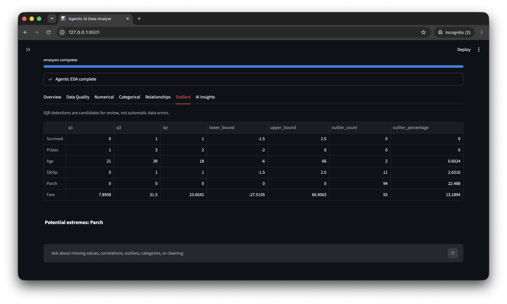
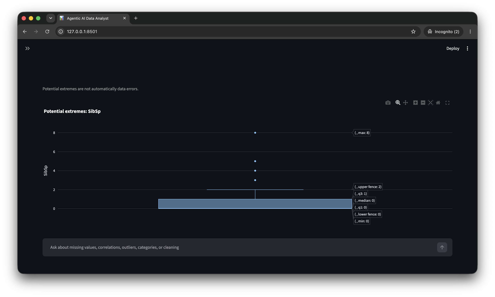

# Agentic AI Data Analyst

A Streamlit application for safe, iterative exploratory data analysis (EDA) of CSV files. It combines **deterministic Pandas/NumPy analysis** with an LLM that plans analyses, evaluates concise verified results, and writes a Markdown report. It does **not** send the uploaded CSV or ask the LLM to calculate statistics.

Groq is the default provider; OpenRouter is also supported through its OpenAI-compatible API. Both are configured with environment variables.

## What you can do

1. Upload a CSV (up to 200 MiB).
2. Inspect the first 10 rows, dataset metrics, and inferred column groups.
3. Optionally select a target column and analysis settings.
4. Run an iterative LangGraph EDA workflow.
5. Review deterministic tables/charts, the sanitized execution trace, and an AI-written report grounded in tool output.
6. Download the report as Markdown.
7. After EDA completes, ask dataset questions through a separate safe LangGraph workflow.

> **Important:** an API key is required to run the agentic workflow. The deterministic tools are covered by offline tests and can be used by the workflow, but the UI intentionally disables **Run Agentic EDA** until the configured provider key is present.

## Demo

The following full-width screenshots show an agentic EDA run on a Titanic passenger dataset. The agent selected analyses for data quality, numerical and categorical features, relationships, and potential IQR outliers.

### Data quality: missing-value results



### Overview: selected analyses and execution trace



### Numerical summary



### Categorical summary



### Relationships: correlation heatmap



### IQR outlier results



### IQR outlier visualization

Potential extremes are candidates for review, not automatically data errors.



## Architecture

```text
CSV upload (in memory)
        |
        v
Deterministic dataset profiler
        |
        v
LLM planner ── compact schema/profile only
        |
        v
Select a validated planned or evaluator-requested tool
        |
        v
Allowlisted deterministic Python EDA tool
        |
        v
LLM evaluator ── compact result and deterministic insights only
        |
        +----------- Need more useful analysis? -----------+
        |                                                  |
       yes                                                no
        |                                                  |
        +------> Select next tool                    Generate report
                                                          |
                                                          v
                                                         END
```

The main graph is constructed in `agent/graph.py` with LangGraph `StateGraph`:

```text
START
  -> profile_dataset
  -> plan_analysis
  -> select_analysis
      -> execute_analysis -> evaluate_analysis --continue--> select_analysis
      -> generate_report
  -> END
```

`select_analysis` does not execute model-produced code. It chooses the first valid, not-yet-run call from the planner's initial plan or the evaluator's requested follow-up. Every proposed call is checked by the registry before it can run.

### Why this is agentic rather than a fixed pipeline

The profiler first determines what exists in the dataset. The planner receives only a compact profile and creates a dataset-specific list of useful analyses; for example, it can favor correlations for meaningful numeric fields, categorical frequencies for categorical fields, and date analysis only for inferred dates. After each execution, the evaluator can request another useful tool or stop. Thus the order and subset of tools vary by dataset and the configured iteration budget.

If model planning, evaluation, or reporting fails, the graph records a recoverable warning and uses a dataset-aware deterministic fallback where possible. A fallback report consists only of verified tool insights.

## Project layout

```text
EDA-Agent/
├── app.py                     # Streamlit UI and session-state orchestration
├── requirements.txt           # Runtime and test dependencies
├── .env.example               # Non-secret provider configuration template
├── agent/
│   ├── state.py               # Typed EDA graph state
│   ├── models.py              # Pydantic models for LLM decisions
│   ├── graph.py               # Main LangGraph and initial state
│   ├── nodes.py               # Profile, plan, select, execute, evaluate, report nodes
│   ├── routing.py             # Conditional-edge functions
│   └── chat_graph.py          # Separate question -> tool -> explanation graph
├── services/
│   ├── dataframe_service.py   # Profiling and semantic-type heuristics
│   └── llm.py                 # Groq/OpenRouter client, retries, JSON parsing
├── tools/                     # Deterministic EDA implementations and strict registry
├── visualization/charts.py    # Bounded deterministic Plotly charts
├── prompts/                   # Planner, evaluator, and reporter prompts
├── utils/csv_loader.py        # In-memory CSV validation/loading
├── tests/                     # Offline tests; no API key needed
└── docs/images/               # README screenshots
```

## Installation

### Prerequisites

- Python **3.10 or newer** (3.11+ is recommended)
- A Groq or OpenRouter API key
- Internet access while the agent is running

Create and activate a virtual environment:

```bash
python -m venv .venv
```

**macOS/Linux**

```bash
source .venv/bin/activate
```

**Windows (PowerShell)**

```powershell
.venv\Scripts\Activate.ps1
```

**Windows (Command Prompt)**

```bat
.venv\Scripts\activate.bat
```

Install the dependencies:

```bash
python -m pip install --upgrade pip
python -m pip install -r requirements.txt
```

If your platform exposes Python as `python3` rather than `python`, substitute `python3` in the commands above and below.

## Configure an LLM provider

Copy the template and edit the new file. Never commit `.env`.

```bash
cp .env.example .env
```

On Windows, create `.env` manually or use:

```powershell
Copy-Item .env.example .env
```

### Groq (default)

```env
LLM_PROVIDER=groq
GROQ_API_KEY=your_groq_api_key
GROQ_MODEL=openai/gpt-oss-20b
```

The client calls Groq's OpenAI-compatible endpoint. Model availability, free-plan eligibility, and rate limits are controlled by the Groq account and can change; replace `GROQ_MODEL` with a currently available Groq model if necessary. Groq free access is not indicated with a `:free` suffix.

### OpenRouter

```env
LLM_PROVIDER=openrouter
OPENROUTER_API_KEY=your_openrouter_api_key
OPENROUTER_MODEL=openrouter/free
```

OpenRouter model IDs and free offerings change over time. Set `OPENROUTER_MODEL` to a currently available model ID for your account (often a model with a `:free` suffix). The application does not hard-code a key or depend on one permanent free model.

Only `groq` and `openrouter` are accepted values for `LLM_PROVIDER`. The configured provider, model, and whether its key is present appear in the Streamlit sidebar; keys are configured through the environment, not entered in the UI.

## Run the application

```bash
streamlit run app.py
```

Streamlit prints a local URL, usually `http://localhost:8501`. Upload a `.csv`, optionally choose a target column in the sidebar, and click **Run Agentic EDA**.

### Sidebar settings

| Setting | Choices / default | Effect |
| --- | --- | --- |
| Max agent iterations | 1–15, default 5 | Hard cap on executed EDA tools for one run. |
| Correlation method | Pearson or Spearman | Passed to correlation analysis. |
| Number of top categories | 3–25, default 10 | Bounds categorical-summary output. |
| Outlier method | IQR (1.5×) | The only supported safe method. |
| Target column | None or any uploaded column | Enables `target_analysis`; no target is assumed by default. |

Changing widgets does not automatically rerun EDA. Uploading a different file resets the prior EDA result and chat history.

## Data handling and profiling

### CSV loading

Files are processed in memory. The loader:

- accepts only `.csv` filenames;
- rejects empty files, header-only files, no-column files, and files larger than **200 MiB**;
- tries `utf-8-sig`, `utf-8`, `cp1252`, then `latin-1`;
- reports parser failures as user-readable upload errors;
- warns about Pandas-renamed probable duplicate headers, one-column datasets, and large datasets.

The preview shows the first 10 rows and metrics for rows, columns, total missing values, duplicate rows, and memory use.

### Semantic groups are heuristics

`services/dataframe_service.py` profiles shape, dtypes, missing and unique counts, duplicates, memory use, numerical/categorical/boolean/datetime-like columns, constants, high-cardinality text, and possible identifiers.

Identifier detection is intentionally conservative: a non-null column must be at least 98% unique and have an ID-like name (`id`, prefix `id_`, suffix `_id`) or, for sufficiently long numeric series, a sequence-like pattern. Datetime inference examines names and date-like values without changing the original DataFrame. Review these inferences before making data decisions.

## Deterministic EDA tools

All tools return a standard envelope with:

- `display_result`: detailed data for Streamlit tables/charts;
- `llm_summary`: bounded facts sent to the LLM;
- `insights`: deterministic, human-readable facts;
- `status`: success or a safely captured error.

| Tool | What it measures |
| --- | --- |
| `dataset_overview` | Shape, schema, memory use, and exact duplicate rows. |
| `missing_value_analysis` | Missing count and percentage for every column; significant columns use a configurable threshold (20% by default). |
| `numerical_summary` | Count, mean, median, standard deviation, min/max, quartiles, skewness, and kurtosis. |
| `categorical_summary` | Unique counts and bounded top-category counts/percentages. |
| `correlation_analysis` | Pearson or Spearman numeric correlation matrix, non-self pairs, and high-correlation pairs. |
| `outlier_analysis` | IQR bounds and candidate outlier count/percentage per numeric feature. |
| `duplicate_analysis` | Exact duplicate count and percentage. |
| `cardinality_analysis` | Unique ratios, cardinality level, and likely identifier signals. |
| `distribution_analysis` | Skewness, quantiles, and zero/negative percentages. |
| `categorical_imbalance_analysis` | Dominant observed categorical values using an 80% default threshold. |
| `datetime_analysis` | Date range, unique dates, largest observed gap, and recent monthly counts. |
| `target_analysis` | User-selected target: class distribution for classification-like targets, or distribution and numeric feature correlations for regression-like targets. |

Identifier-like numeric columns are excluded from ordinary numeric summaries, distributions, outlier detection, and correlations. A target is never inferred from the last column.

## Safety, validation, and reliability

### Tool boundary

The LLM can select only names in `tools/registry.py`. Pydantic schemas reject extra arguments and validate argument ranges. Requested columns and targets must exist in the uploaded frame. There is no `eval`, `exec`, shell invocation, generated Python, or model-generated plotting code.

### Prompt boundary

The runtime DataFrame remains in graph state for deterministic nodes, but is never serialized into an LLM prompt. Prompts receive compact profile metadata, bounded tool summaries, deterministic insights, the user-selected target, and the question where applicable. This reduces exposure of uploaded data and reduces unsupported numerical claims.

### Loop and failure protection

- The UI and initial graph state clamp iterations to 1–15.
- A SHA-256 fingerprint of tool name plus normalized arguments prevents identical calls from running twice.
- Routing also ends the loop when the evaluator says no or the iteration cap is reached.
- Structured model output is validated with Pydantic. Invalid JSON is retried once.
- Authentication, timeout, connection, rate-limit, unavailable-model, empty-response, and malformed-response failures are turned into readable errors or graph fallbacks.
- Tool exceptions become an error result instead of crashing the graph.

### Statistical cautions

Correlation does not establish causation. IQR detections are candidates for investigation, not proof of invalid data. Missing data does not automatically mean rows should be removed. High cardinality, skewness, and identifier inference require domain review.

## Charts and results UI

The results tabs are **Overview**, **Data Quality**, **Numerical**, **Categorical**, **Relationships**, **Outliers**, and **AI Insights**. Charts are created only when their source tool ran successfully:

- missing-value bar chart;
- up to four numeric distribution histograms;
- correlation heatmap (up to 10 columns);
- up to four categorical bar charts;
- up to three numeric box plots for highest IQR-outlier percentages;
- selected-target distribution chart.

For datasets over 100,000 rows, aggregate tools still use the complete dataset. Visualizations use a deterministic random sample of at most 10,000 rows and display that note. The report can be downloaded from the **AI Insights** tab as `eda_report.md`.

The **Agent Execution Trace** shows only intentionally stored node details, tool choices, concise reasons, statuses, and observations. It does not expose hidden chain-of-thought.

## Ask Your Dataset

This feature appears after an EDA run. Each question runs a separate, smaller LangGraph:

```text
question -> select one safe tool -> execute it -> grounded explanation
```

The model chooses exactly one allowlisted tool, the app validates and executes it, and the model explains only the verified result. If no target was selected, an attempted target analysis falls back to `dataset_overview`. Conversation messages are retained in Streamlit session state until a new file is uploaded.

## Testing and checks

The test suite is fully offline and does not need an API key. It covers CSV loading, semantic profiling and identifier detection, core tool statistics, registry validation, chart selection, and an end-to-end graph run using a fake LLM.

```bash
python -m pytest -q
python -m compileall .
```

## Dependencies

`requirements.txt` contains only packages used by the application or test suite:

- `streamlit` — web UI
- `pandas`, `numpy` — data loading and deterministic analysis
- `langgraph` — explicit main and chat state graphs
- `openai` — Groq/OpenRouter OpenAI-compatible client
- `python-dotenv` — `.env` loading
- `pydantic` — LLM output and tool argument validation
- `plotly` — deterministic interactive charts
- `pytest` — tests

## Limitations

- Only CSV uploads are supported; parsing depends on Pandas' CSV support.
- The 200 MiB in-memory upload limit is a guardrail, not a guarantee that every dataset below it will fit comfortably in available RAM.
- Datetime and identifier classification are heuristics.
- Full-data analysis can still be expensive for very wide or large datasets.
- The planner/evaluator/report quality and availability depend on the configured provider/model. Fallbacks remain factual but may be less tailored.
- The chat feature answers a question through one analysis tool, so complex multi-part questions may need separate prompts.
- The app does not train models, alter the uploaded data, or prove causal relationships.
