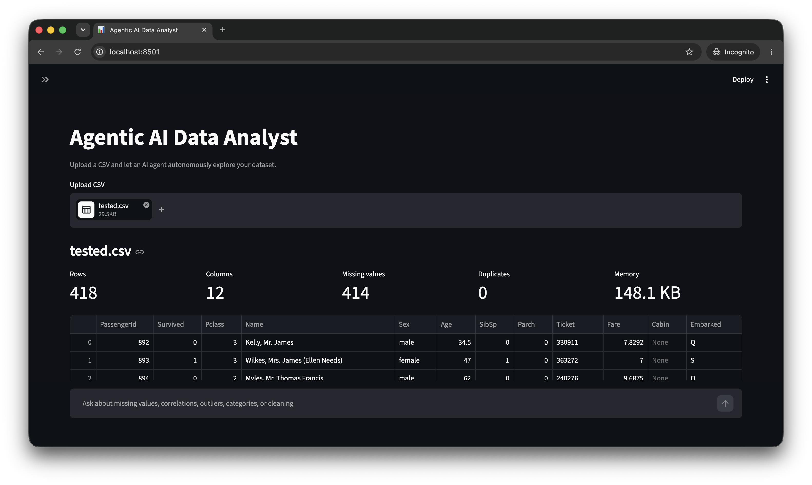
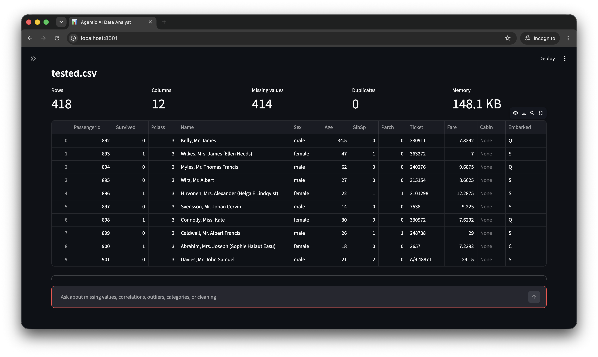
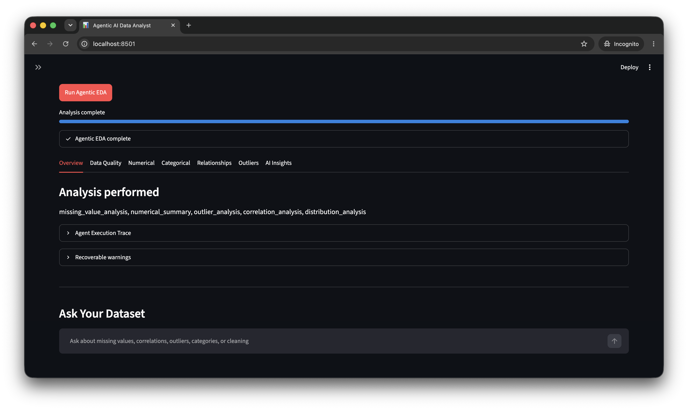
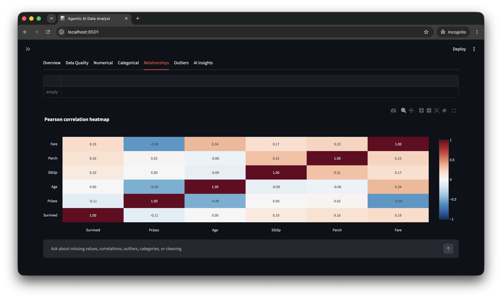
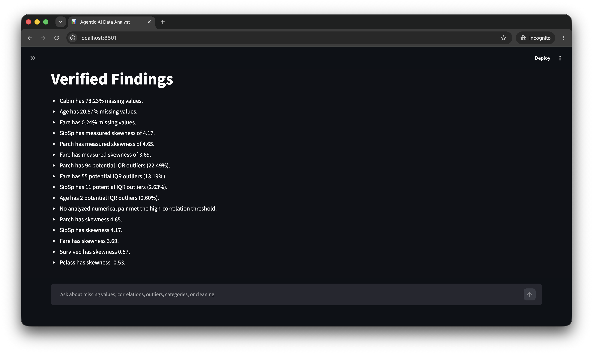
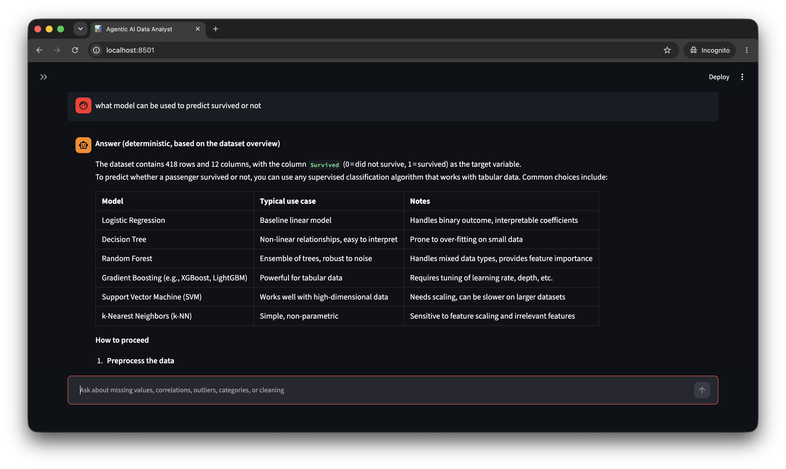

# Agentic AI Data Analyst

A production-minded, beginner-readable Streamlit application that uses LangGraph and Groq to autonomously plan exploratory data analysis. Pandas and NumPy calculate every statistic; the language model plans, chooses allowlisted tools, evaluates compact results, and writes a grounded report. OpenRouter remains available as an optional provider.

## Demo

The screenshots below were captured from the running application using a sample Titanic passenger dataset.

### CSV upload and dataset profile





### Agentic workflow



### Deterministic analysis results





### Ask Your Dataset



## Architecture

```text
CSV Upload
   |
   v
Dataset Profiler
   |
   v
EDA Planner Agent
   |
   v
Tool Selection
   |
   v
Python EDA Tool
   |
   v
Result Evaluator
   |
   +------ Need More Analysis? ------+
   |                                 |
  YES                               NO
   |                                 |
   +----> Tool Selection       Final Report
```

This is agentic rather than a fixed EDA pipeline: the planner receives the inferred schema and compact metadata, constructs a dataset-specific plan, and the evaluator decides after every result whether another investigation is justified. LangGraph conditional edges implement that loop. An iteration limit and duplicate-call fingerprints guarantee termination.

The DataFrame remains in graph runtime state for deterministic nodes, but it is never serialized into an LLM prompt. Only the compact profile and compressed tool facts are sent to the configured LLM provider.

## Installation

Python 3.11 or newer is recommended.

```bash
python -m venv venv
```

Windows:

```bash
venv\Scripts\activate
```

macOS/Linux:

```bash
source venv/bin/activate
```

Install dependencies:

```bash
pip install -r requirements.txt
```

Copy `.env.example` to `.env`, add a Groq key, and run:

```bash
streamlit run app.py
```

## LLM configuration

```env
LLM_PROVIDER=groq
GROQ_API_KEY=your_groq_api_key
GROQ_MODEL=openai/gpt-oss-20b
```

The default Groq configuration uses its OpenAI-compatible endpoint and the fast `openai/gpt-oss-20b` model. To use OpenRouter instead, set `LLM_PROVIDER=openrouter`, `OPENROUTER_API_KEY`, and `OPENROUTER_MODEL`. API authentication, timeouts, model errors, rate limits, empty responses, and malformed JSON are converted to useful application errors or safe graph fallbacks.

`openai/gpt-oss-20b` is available within Groq's Free Plan rate limits. Groq does not use a `:free` model suffix: free access is controlled by the Groq account tier and its request/token quotas. The client does not request paid burst or on-demand service tiers, and the UI defaults to five agent iterations to conserve the free quota.

## How LangGraph works here

- **State:** `EDAState` carries the runtime DataFrame, compact profile, plan, current validated tool call, bounded results, observations, execution trace, iteration count, and report.
- **Nodes:** profiling, planning, selection, tool execution, evaluation, and reporting are separate functions.
- **Edges:** fixed edges connect required stages.
- **Conditional edges:** selection can route to execution or reporting; evaluation can loop to another selection or finish.
- **Loop safety:** `max_iterations` is enforced in routing and selection. A SHA-256 fingerprint prevents an identical tool and argument set from running twice.
- **Failure behavior:** malformed model output is retried once. Dataset-aware deterministic fallbacks preserve useful results without pretending an API call succeeded.

The post-report **Ask Your Dataset** feature uses its own smaller LangGraph: question → safe tool selection → Python execution → grounded explanation.

## Available EDA tools

- `dataset_overview`
- `missing_value_analysis`
- `numerical_summary`
- `categorical_summary`
- `correlation_analysis` (Pearson or Spearman)
- `outlier_analysis` (IQR)
- `duplicate_analysis`
- `cardinality_analysis`
- `distribution_analysis`
- `categorical_imbalance_analysis`
- `datetime_analysis`
- `target_analysis` (only for an explicitly selected target)

Tools return a complete `display_result` for Streamlit and a compressed `llm_summary` for prompts. Charts are deterministic and limited in number. For more than 100,000 rows, aggregate statistics still use full data while visualizations sample at most 10,000 rows and label that fact.

## Security

- No `eval`, `exec`, shell invocation, or generated plotting code is used.
- Model tool names are checked against an allowlist.
- Pydantic rejects extra parameters; column and target names must exist.
- CSVs are processed in memory and never forwarded wholesale to the LLM provider.
- API keys come only from environment configuration and are ignored by Git.
- Identifier inference and target selection are conservative; the final column is never assumed to be a target.

## Testing

Run deterministic tests without an API key:

```bash
pytest -q
python -m compileall .
```

Tests cover profiling, semantic identifier detection, missing values, numerical statistics, correlation pair extraction, IQR outliers, and registry validation.

## Limitations

- Identifier and datetime detection are heuristics and should be reviewed.
- IQR flags are candidates for investigation, not proof of bad data.
- Correlation does not establish causality.
- CSV dialects that Pandas cannot parse are rejected with a diagnostic.
- Provider models vary in JSON reliability and availability; the app retries and falls back safely, but report quality can vary.
- Time-gap analysis reports observed gaps and does not infer the intended business frequency.
